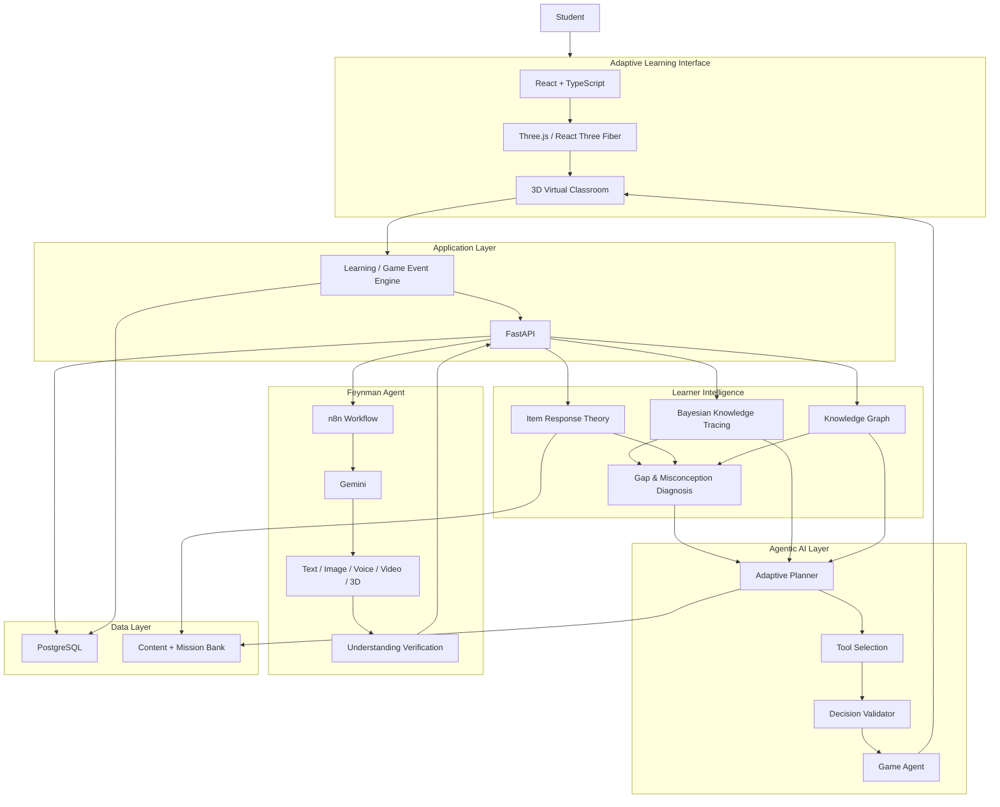

# PS.md — Learniverse AI

## 1. Problem Statement

Traditional digital learning platforms largely follow a fixed curriculum: students receive the same sequence of concepts, similar assessments, and predefined learning paths regardless of their existing knowledge.

This creates three major problems:

- **Different starting points:** Students enter a course with different levels of prior knowledge.
- **Hidden knowledge gaps:** A student may struggle with an advanced concept because a prerequisite concept was never properly understood.
- **Limited adaptation:** Most platforms adapt individual questions or explanations, but do not continuously change the learner's overall path based on a structured model of what the student actually knows.

### Core Problem

> **How can we create an intelligent learning system that continuously understands what a student knows, identifies prerequisite gaps and misconceptions, decides what the student should learn next, and adapts both the learning content and learning environment accordingly?**

---

## 2. Solution

### Learniverse AI

**Learniverse AI** is an **agentic adaptive learning platform** that continuously models a student's knowledge and dynamically personalizes their learning journey.

### Tagline

> **Your knowledge shapes your classroom.**

The system combines:

- **Bayesian Knowledge Tracing (BKT)** for estimating concept mastery.
- **Knowledge Graphs** for representing concepts and prerequisite relationships.
- **Item Response Theory (IRT)** for adaptive assessment.
- **Agentic AI** for diagnosis, planning, tool selection, execution, evaluation, and replanning.
- **Feynman Agent** for multimodal explanations when a student struggles.
- **3D Adaptive Virtual Classroom** where learning areas, missions, difficulty, support, and concept access can change according to learner state.
- **Spaced repetition** for long-term retention.

### Core Learning Loop

```text
Student Interaction
       ↓
Learning Evidence
       ↓
Learner Model
(BKT + Assessment Data)
       ↓
Knowledge Graph
(Prerequisites)
       ↓
Agentic Diagnosis
       ↓
Adaptive Planner
       ↓
Best Next Learning Action
       ↓
Feynman Agent / Mission / Game Agent
       ↓
Adaptive Learning Environment
       ↓
New Student Evidence
       ↺
```

The system continuously determines:

> **What does this student understand now, what are they missing, and what should they do next?**

---

# 3. Technical Approach

## 3.1 High-Level Architecture



## 3.2 Component Responsibilities

### Student Interaction Layer

The student interacts with:

- 3D classroom
- Concept stations
- Learning missions
- Adaptive assessments
- AI Mentor
- Feynman Agent
- Interactive concept visualizations

Every meaningful interaction produces structured learning evidence.

### Learner Model

The learner model stores the student's evolving knowledge state. BKT updates mastery from evidence rather than allowing an LLM to directly change mastery.

Example:

```json
{
  "student_id": "S001",
  "concepts": {
    "arrays": 0.91,
    "linked_lists": 0.76,
    "stacks": 0.38,
    "recursion": 0.21
  }
}
```

### Knowledge Graph

The Knowledge Graph represents relationships such as:

```text
Linked List
     ↓
Stack
     ↓
Recursion
     ↓
Trees
```

It allows the system to identify prerequisite gaps.

Example:

```text
Recursion mastery = 21%
Stack mastery     = 38%

Recursion requires Stack >= 70%

→ Stack remediation becomes the next action.
```

### Adaptive Assessment

IRT can select questions according to estimated learner ability and item difficulty.

Assessment evidence can include:

- correctness
- response time
- attempt number
- concept
- skill
- difficulty
- hint usage

### Agentic Planner

The planner can:

1. Observe learner evidence.
2. Retrieve relevant learner context.
3. Diagnose a learning gap.
4. Check prerequisites.
5. Create a multi-step learning plan.
6. Select appropriate tools.
7. Execute actions.
8. Observe new evidence.
9. Replan when necessary.

Example:

```text
Student struggles with Recursion
            ↓
Retrieve mastery
            ↓
Stack mastery = 38%
            ↓
Check prerequisite graph
            ↓
Identify Stack prerequisite gap
            ↓
Plan:
  1. Stack remediation
  2. Feynman explanation
  3. Easy Stack mission
  4. Reassess
  5. Recheck Recursion prerequisite
  6. Unlock Recursion if ready
```

### Feynman Agent

When a student has difficulty understanding a concept, the Feynman Agent identifies the underlying learning gap and selects an appropriate explanation modality:

- Text
- Diagram
- Image
- Voice
- Short AI-generated video
- Code trace
- Interactive 3D visualization

Example:

```text
Student: "I don't understand recursion."
             ↓
Feynman Agent
             ↓
Analyze learner context
             ↓
Identify call-stack confusion
             ↓
Select visual / video explanation
             ↓
Verify understanding
             ↓
Generate learning evidence
```

### Adaptive 3D Environment

The 3D classroom is the execution and visualization layer of the adaptive system.

Example:

```text
Stack mastery: 38%
        ↓
Stack Lab → ACTIVE
Recursion Lab → LOCKED

After remediation:

Stack mastery: 76%
        ↓
Recursion prerequisite satisfied
        ↓
Recursion Lab → UNLOCKED
Advanced mission → AVAILABLE
```

The environment changes at meaningful adaptation points rather than after every interaction.

### Game Agent

The Game Agent converts validated learning decisions into structured world updates.

```json
{
  "action": "REMEDIATE",
  "concept": "stack",
  "difficulty": "easy",
  "zone": "stack_lab",
  "mission_template": "stack_push_pop_01",
  "npc_support": true
}
```

The frontend renders the decision; it does not independently determine mastery or prerequisite truth.

---

# 4. Tech Stack

| Layer | Technology | Purpose |
|---|---|---|
| Frontend | React + TypeScript | Application UI |
| 3D Engine | Three.js | 3D rendering |
| 3D Integration | React Three Fiber + Drei | Interactive 3D classroom |
| State Management | Zustand | UI/world state |
| Styling | Tailwind CSS | Interface |
| Backend | FastAPI + Python | APIs and learning services |
| Agent Orchestration | LangGraph | Agentic planning and stateful workflows |
| Workflow Automation | n8n | Feynman multimodal orchestration |
| Multimodal AI | Gemini | Reasoning and explanations |
| Speech-to-Text | Groq Whisper | Voice input |
| Learner Modeling | BKT | Concept mastery estimation |
| Adaptive Assessment | IRT | Question selection |
| Knowledge Representation | Knowledge Graph / Neo4j | Prerequisites and relationships |
| Database | PostgreSQL | Persistent learner/application data |
| 3D Assets | Blender + GLB/GLTF | Asset creation and optimization |
| Deployment | Render | Cloud deployment |
| Version Control | Git + GitHub | Source control |

### Architectural Principle

```text
Deterministic Systems
        ↓
Source of Truth

BKT → mastery
Knowledge Graph → prerequisites
Database → history
Content Bank → questions/missions
Validator → progression constraints

AI Agents
        ↓
Reasoning + Planning + Explanation + Tool Selection
```

---

# 5. Feasibility and Viability Analysis

## 5.1 Technical Feasibility

**High for an MVP.**

The required components are based on existing technologies:

- React/Three.js for the 3D environment.
- FastAPI for learning APIs.
- PostgreSQL for learner and interaction data.
- BKT and IRT for learner modeling.
- Knowledge Graphs for prerequisite dependencies.
- LangGraph for agentic workflows.
- n8n for multimodal Feynman workflows.
- Gemini for AI reasoning and explanation.
- Existing GLB/GLTF assets to reduce 3D development effort.

### MVP Scope

Demonstrate one strong vertical slice:

```text
Stack
  ↓
Remediation
  ↓
Feynman Explanation
  ↓
Assessment
  ↓
Mastery Update
  ↓
Recursion Unlock
```

**DSA is the initial demonstration domain, not the final product scope.** The same architecture can support other concept-heavy subjects.

## 5.2 Operational Viability

A lean deployment can use:

```text
Render
├── React Frontend
├── FastAPI Backend
├── PostgreSQL
├── Background Worker
└── n8n
```

Open-source software and free/low-cost tiers can reduce initial infrastructure costs.

AI inference is the major variable cost, so routine decisions should be handled by deterministic systems while LLM calls are reserved for reasoning, tutoring, explanation and multimodal generation.

## 5.3 Economic Viability

Proposed student pricing:

> **₹1,499 per student/year**

### Freemium

**Free**
- Basic diagnostic assessment
- Limited adaptive learning
- Basic progress tracking
- Limited Feynman assistance

**Premium**
- Deeper personalization
- Expanded AI tutoring
- Multimodal Feynman Agent
- Advanced adaptive assessments
- Detailed mastery analytics
- Advanced interactive learning experiences

Initial Year-1 target:

> **500 paying students**

Illustrative annual revenue:

```text
500 × ₹1,499
= ₹7,49,500
≈ ₹7.5 lakh/year
```

These are initial business hypotheses to be validated through student pilots.

## 5.4 Risks and Mitigation

| Risk | Mitigation |
|---|---|
| LLM/API failure | Deterministic planner + cached content + fallback workflows |
| High AI cost | Use LLM only where generative intelligence is needed |
| Incorrect AI decisions | Structured outputs + deterministic validation |
| 3D complexity | Reuse existing assets and keep MVP environment small |
| Unproven learning outcomes | Pre/post assessments with real students |
| Content scalability | Reusable concept, mission and assessment schemas |
| Architecture complexity | Start with one vertical slice and expand incrementally |

---

# 6. Impact and Benefits

## Student Benefits

- **Personalized learning:** Learning activities reflect current knowledge.
- **Early gap detection:** Prerequisite weaknesses can be identified before they block progress.
- **Better explanations:** Feynman can switch modalities when an explanation is not effective.
- **Adaptive difficulty:** Activities can move from guided practice to advanced/transfer tasks.
- **Long-term retention:** Spaced repetition can reinforce important concepts.
- **Engagement:** Interactive 3D environments can make abstract concepts more tangible.

## Faculty / Institution Benefits

- Learner-level mastery insights.
- Identification of commonly weak concepts.
- Adaptive remediation recommendations.
- Learning progress analytics.
- Potential integration with existing learning systems.
- Reduced need to manually create separate paths for every student.

## Broader Impact

The architecture can extend beyond DSA:

```text
                 Adaptive Engine
                       │
       ┌───────────────┼───────────────┐
       ↓               ↓               ↓
      DSA          Mathematics       Physics
       ↓               ↓               ↓
Concept Graph      Concept Graph    Concept Graph
       ↓               ↓               ↓
 Learning World    Learning World   Learning World
```

The core engine remains the same while subject-specific content, concepts, prerequisites, assessments and visualizations change.

---

# 7. Novelty

The novelty is not simply the use of AI, 3D graphics, or multiple agents individually.

### 1. Knowledge-Driven Adaptation

The system maintains an explicit learner model and prerequisite graph rather than relying only on conversational AI.

### 2. Agentic Learning Orchestration

Agents can observe, diagnose, plan, select tools, execute interventions, evaluate results and replan.

### 3. Multimodal Feynman Agent

Instead of repeatedly giving the same type of explanation, the system can select a suitable modality based on learner difficulty and previous response.

### 4. Adaptive 3D Learning Environment

The 3D environment is not merely a visual interface. Its learning areas, access, missions, difficulty and support can change according to validated learner-state decisions.

### 5. Closed-Loop Learning

```text
Evidence
   ↓
Learner Model
   ↓
Diagnosis
   ↓
Planning
   ↓
Intervention
   ↓
New Evidence
   ↺
```

### Key Novelty Statement

> **Learniverse AI combines structured learner modeling, prerequisite-aware agentic planning, multimodal Feynman tutoring, and a dynamically adaptive 3D learning environment into a closed-loop system where the student's demonstrated knowledge directly shapes what they learn next and how the learning environment responds.**

---

# 8. Market Positioning

## Target Customer

### Primary Segment

> **College students learning concept-heavy subjects who struggle when conventional courses fail to adapt to their existing knowledge, misconceptions and pace.**

DSA is the initial demonstration domain; the product is intended to expand to other concept-heavy subjects.

### Future Segments

- Engineering students
- STEM learners
- Professional upskilling learners
- Faculty and educators
- Colleges and universities
- Training organizations

## Competitive Positioning

Learniverse AI should not be positioned simply as another AI tutor.

### Conventional AI Tutor

```text
Student Question
      ↓
AI Answer
      ↓
Next Question
```

### Learniverse AI

```text
Student Evidence
      ↓
Learner Model
      ↓
BKT + Knowledge Graph
      ↓
Gap / Misconception Detection
      ↓
Agentic Planner
      ↓
Best Next Learning Action
      ↓
Feynman / Mission / 3D Environment
      ↓
New Evidence
      ↺
```

### Positioning Statement

> **Unlike conventional AI tutors that primarily adapt the conversation, Learniverse AI continuously maintains a structured model of what the student understands, identifies prerequisite gaps, and uses that model to change what the student learns next—and how the 3D learning environment responds.**

## Market Entry Strategy

### Phase 1 — Student Validation

Use:

- College technical clubs
- AI/ML communities
- Coding communities
- Student developer communities
- Faculty-led student groups

Goal:

> Test with 20–50 real students and measure learning improvement, engagement, AI usage and willingness to pay.

### Phase 2 — Campus Expansion

Use:

- Student ambassadors
- Faculty referrals
- Workshops
- College partnerships
- Technical clubs

### Phase 3 — Institutional Expansion

Potential offerings:

- Student subscriptions
- Institution licenses
- Faculty dashboards
- Learning analytics
- Subject-specific adaptive courses

---

# 9. Overall Value Proposition

> **Learniverse AI transforms learning from a fixed, one-size-fits-all journey into an adaptive experience where every student receives the right explanation, challenge and learning path based on what they understand right now.**

### Core Differentiator

> **The student does not adapt to the classroom. The classroom adapts to the student.**

---

# 10. MVP Success Criteria

The MVP should demonstrate that:

- A student can enter the learning environment.
- Student interactions generate structured learning evidence.
- BKT updates concept mastery.
- The Knowledge Graph evaluates prerequisites.
- The agent diagnoses a learning gap.
- The agent creates a multi-step learning plan.
- The agent selects appropriate tools.
- The Feynman Agent provides an adaptive explanation.
- The student completes remediation.
- Mastery is reassessed.
- A previously locked concept becomes available when its prerequisite condition is satisfied.
- The 3D classroom responds to validated adaptive decisions.
- Different learner states produce different learning journeys.
- The system continues functioning through deterministic fallback mechanisms.

---

# 11. One-Line Project Definition

> **Learniverse AI is an agentic adaptive learning system that models what students know, identifies what they are missing, autonomously plans the next learning intervention, explains difficult concepts multimodally, and dynamically adapts the 3D learning environment to their evolving knowledge.**
