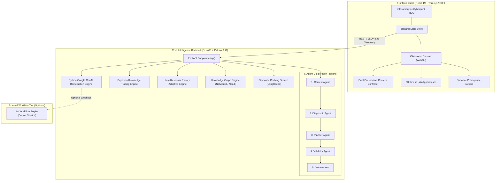
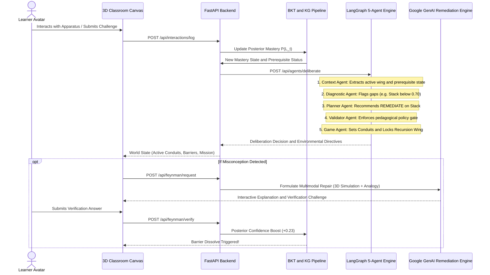

# LearniVerse-AI: Adaptive Agentic 3D Virtual Classroom 🎓🌌

> **"Your knowledge shapes your classroom."**  
> An autonomous, agentic 3D cybernetic learning environment where physical architectural barriers, kinetic apparatuses, learning paths, and pedagogical guidance dynamically adapt to each learner's evolving knowledge state.

[](https://learniverse-frontend.onrender.com)
[](https://learniverse-backend-a4go.onrender.com)
[](https://learniverse-n8n.onrender.com)
[](https://opensource.org/licenses/MIT)
[](https://docs.pmnd.rs/react-three-fiber)

🎮 **Experience the 3D Classroom Live**: [**https://learniverse-frontend.onrender.com**](https://learniverse-frontend.onrender.com)  
⚡ **Live Backend API**: [**https://learniverse-backend-a4go.onrender.com**](https://learniverse-backend-a4go.onrender.com) (API Docs: [`/docs`](https://learniverse-backend-a4go.onrender.com/docs))  
🔄 **Live n8n Workflow Orchestrator**: [**https://learniverse-n8n.onrender.com**](https://learniverse-n8n.onrender.com)

---

## 📑 Table of Contents
1. [Problem Statement](#-1-problem-statement)
2. [The LearniVerse-AI Solution](#-2-the-learniverse-ai-solution)
3. [How to Approach the App (Learner Journey & Navigation)](#-3-how-to-approach-the-app-learner-journey--navigation)
4. [Key Features & Capabilities](#-4-key-features--capabilities)
5. [System Architecture & Technical Diagrams](#-5-system-architecture--technical-diagrams)
6. [API Endpoints & Service Contracts](#-6-api-endpoints--service-contracts)
7. [Local Setup & Development](#-7-local-setup--development)
8. [Production Deployment Architecture](#-8-production-deployment-architecture)
9. [Verification & Automated Testing](#-9-verification--automated-testing)

---

## 🚨 1. Problem Statement

Traditional digital learning platforms and computer-based tutors follow a rigid, one-size-fits-all curriculum model:
1. **Different Starting Baselines**: Learners arrive with disparate prior knowledge, yet are forced through the same sequential lessons.
2. **Hidden Prerequisite Gaps**: When a learner struggles with an advanced computer science concept (e.g., *Tree Traversal* or *Recursion*), the true root cause is almost always an unmastered foundational concept (e.g., *Call Stacks* or *Pointers*). Standard platforms merely repeat the advanced exercise rather than diagnosing and remediating the root prerequisite gap.
3. **Superficial Adaptation**: Most learning platforms only adapt individual multiple-choice question difficulties, failing to adapt the overall curriculum, the learning environment, or the explanation modalities to how the learner best absorbs information.
4. **Passive Learning Overload**: Abstract concepts (data structures, memory pointers, recursion call stacks) are taught through static 2D text and code snippets rather than interactive, tactile, spatial mechanical demonstrations.

### Core Research Challenge
> *How can an intelligent learning system continuously model a learner's latent mastery state, identify foundational prerequisite gaps and misconceptions, plan optimal remediation sequences, and dynamically morph both pedagogical content and the 3D physical environment in real time?*

---

## 💡 2. The LearniVerse-AI Solution

**LearniVerse-AI** fuses mathematical psychometrics, multi-agent artificial intelligence, knowledge graph theory, and an interactive 3D WebGL virtual world:

* 📊 **Probabilistic Knowledge Modeling**:
  * **Bayesian Knowledge Tracing (BKT)**: Formally computes the posterior probability of concept mastery $P(L_t)$ following every student interaction, balancing prior mastery ($L_0$), transit probability ($T$), guess probability ($G$), and slip probability ($S$).
  * **Item Response Theory (IRT - 2-Parameter Logistic)**: Estimates latent learner ability $\theta$ and item parameters ($\alpha$ discrimination, $\beta$ difficulty) for Computerized Adaptive Testing (CAT).
* 🕸️ **Prerequisite Knowledge Graph DAG**:
  * Models computer science curriculum as a strict Directed Acyclic Graph (DAG) of concepts and dependencies:  
    `Arrays` $\rightarrow$ `Linked Lists` $\rightarrow$ `Stacks` $\rightarrow$ `Recursion` $\rightarrow$ `Trees & BST`.
* 🤖 **5-Agent LangGraph Deliberation Pipeline**:
  * An automated 5-agent deliberation loop (**Context $\rightarrow$ Diagnostic $\rightarrow$ Planner $\rightarrow$ Validator $\rightarrow$ Game Agent**) that evaluates learning evidence, inspects knowledge gaps, enforces policy guardrails, and triggers environmental adaptations.
* 🧠 **Multimodal Feynman Agent**:
  * Detects conceptual misconceptions (e.g., confusing LIFO with FIFO) and provides multimodal pedagogical repairs (Tactile 3D Simulations, Analogies, Interactive Visualizations, Audio/Voice via Groq Whisper, and Code).
* 🏛️ **3D Cybernetic Campus**:
  * An architectural classroom where **Prerequisite Barriers** (holographic forcefields) physically lock access to wings until foundational prerequisites reach the 70% mastery threshold, and **Kinetic Apparatuses** mechanize data structure operations (Pushing stack discs, pointer traversal, recursion call stack elevators).

---

## 🧭 3. How to Approach the App (Learner Journey & Navigation)

```text
 ┌────────────────────────────────────────────────────────────────────────┐
 │                      🌐 ATRIUM (CENTRAL DAIS)                          │
 │  • Holographic Knowledge Graph Beacon                                 │
 │  • AI Mentor Companion Beacon [E]                                      │
 │  • Emissive Guiding Conduits pulsing toward target stations            │
 └───────┬──────────────────┬──────────────────┬──────────────────┬───────┘
         │                  │                  │                  │
         ▼ (West Wing)      ▼ (East Wing)      ▼ (South Wing)     ▼ (North Wing)
  ┌──────────────┐   ┌──────────────┐   ┌──────────────┐   ┌──────────────┐
  │ ARRAY LAB    │   │ LINKED LIST  │   │ STACK LAB    │   │ RECURSION LAB│
  │ Contiguous   │   │ Heap Pointers│   │ LIFO Push/Pop│   │ Prereq Gate: │
  │ Index Bays   │   │ Node Links   │   │ Kinetic Tower│   │ Stack ≥ 0.70 │
  └──────────────┘   └──────────────┘   └──────────────┘   └──────────────┘
```

### Step-by-Step Experience

1. **Spawn at the Central Dais (Atrium)**:
   * The learner spawns on the elevated central dais in the cybernetic atrium.
   * View the pulsating holographic knowledge graph and the AI Mentor companion beacon.
2. **Dual-Perspective Camera Controls**:
   * **Third-Person Perspective (3P)**: The camera automatically tracks and glides behind your avatar as you navigate with <kbd>W</kbd>, <kbd>A</kbd>, <kbd>S</kbd>, <kbd>D</kbd>. Pressing <kbd>S</kbd> smoothly backpedals while maintaining forward gaze. Left-click and drag to freely orbit.
   * **First-Person Perspective (1P)**: Press <kbd>V</kbd> to enter eye-level FPP mode. Click into the canvas to engage **Pointer Lock** and look around with raw mouse movement just like in modern FPS games. Press <kbd>ESC</kbd> to unlock your cursor.
3. **Computerized Adaptive Diagnostic Assessment**:
   * Click the **"Diagnostic Assessment"** button on the HUD to take an adaptive 2PL-IRT assessment.
   * Based on your answers, your latent ability $\theta$ is estimated and Bayesian mastery scores are initialized across topics.
4. **Follow Emissive Floor Conduits**:
   * Glowing energy conduits along the floor pulse dynamically, directing the avatar toward the highest-priority learning station chosen by the Planner Agent.
5. **Encounter Prerequisite Barriers & Diagnostic Plaques**:
   * Approach the North Wing (*Recursion Lab*). If Stack mastery is below 0.70, an energized crimson holographic forcefield blocks entry.
   * A diagnostic plaque displays: `Prerequisite Gap: STACK mastery 0.38 < 0.70`.
6. **Operate In-Lab 3D Kinetic Apparatuses**:
   * **Stack Apparatus (South Wing)**: Mechanically push colored memory discs onto the stack tower and pop them in strict LIFO order.
   * **Array Station (West Wing)**: Execute $O(1)$ random access indexing and $O(n)$ linear scans across colored physical memory bays.
   * **Linked List Station (East Wing)**: Traverse dynamic memory node pointers connected by energy vectors ending at `NULL`.
   * **Recursion Elevator (North Wing)**: Watch call-stack frames physically stack vertically on an elevator shaft and unwind during base-case returns.
   * **Tree Canopy (South-East Wing)**: Execute recursive In-Order ($Left \rightarrow Root \rightarrow Right$) traversals on an illuminated binary search tree.
7. **Consult the AI Mentor & Multimodal Feynman Agent**:
   * Approach the AI Mentor beacon on the Central Dais and press <kbd>E</kbd> (or click **AI Mentor** on HUD).
   * Request an explanation, speak using voice input (transcribed via Groq Whisper), or type a question.
   * If a misconception is detected, the **Feynman Agent** launches a repair session, utilizing analogies, code, and tactile 3D demonstrations.
8. **Witness the Barrier Dissolve Transformation**:
   * Once Stack mastery reaches 0.74 ($> 0.70$), the system triggers an architectural **Barrier Dissolve** sequence with a cinematic camera cut: the energy gate dissolutes into particles, granting physical access to the Recursion Chamber.
9. **Inspect Agent Deliberation in the Telemetry Drawer**:
   * Press <kbd>T</kbd> (or click **Telemetry** on HUD) to open the real-time Multi-Agent Telemetry Drawer.
   * Watch the live deliberation trace, inspect Bayesian mastery updates, and examine policy validation rules.

---

## ✨ 4. Key Features & Capabilities

| Feature Pillar | Technical Implementation | Pedagogical Impact |
|---|---|---|
| **Bayesian Knowledge Tracing** | Closed-form Bayesian posterior updates ($L_0, T, G, S$) | Guarantees mathematically sound mastery tracking; immune to hallucinated LLM scores. |
| **Adaptive IRT Testing** | 2-Parameter Logistic ($a, b$) Fisher Information maximization | Diagnoses student ability in 4–6 questions with minimal test fatigue. |
| **5-Agent LangGraph Deliberation** | Context $\rightarrow$ Diagnostic $\rightarrow$ Planner $\rightarrow$ Validator $\rightarrow$ Game Agent | Decouples pedagogical planning from game state; enforces hard prerequisite rules. |
| **Feynman Misconception Repair** | Multimodal explanation synthesis (Text, Voice, 3D simulation, Code) | Directly dismantles cognitive traps (e.g. LIFO vs FIFO) via targeted analogies. |
| **Kinetic 3D Apparatuses** | Procedural Three.js WebGL kinetic models with spatial sound effects | Replaces passive syntax memorization with tactile mechanical discovery. |
| **Physical Prerequisite Barriers** | Dynamic collision meshes, shader dissolve animations, audio cues | Makes curriculum prerequisites an experiential physical boundary in 3D space. |
| **Dual-Perspective Camera** | Smooth 3P chase camera + 1P FPP mouselook with Pointer Lock | Provides cinematic exploration and immersive hands-on lab examination. |
| **Semantic Response Caching** | LangCache cosine semantic similarity threshold ($>0.92$) | Sub-50ms explanation retrieval; cuts external LLM API costs by up to 70%. |

---

## 🏛️ 5. System Architecture & Technical Diagrams

### 5.1 High-Level Architectural Topology



---

### 5.2 5-Agent Deliberation & Adaptive Learning Cycle



---

### 5.3 Curriculum Knowledge Graph DAG

```mermaid
flowchart LR
    classDef mastered fill:#10b981,stroke:#059669,stroke-width:2px,color:#fff;
    classDef active fill:#0ea5e9,stroke:#0284c7,stroke-width:2px,color:#fff;
    classDef locked fill:#ef4444,stroke:#b91c1c,stroke-width:2px,color:#fff;

    Arrays["Arrays and Memory<br>(Mastery: 0.92)"]:::mastered
    LinkedList["Linked Lists<br>(Mastery: 0.78)"]:::mastered
    Stacks["Stacks (LIFO)<br>(Mastery: 0.38 - Remediation)"]:::active
    Recursion["Recursion Chamber<br>(LOCKED - Prereq: Stack >= 0.70)"]:::locked
    Trees["Trees and BST<br>(LOCKED - Prereq: Recursion >= 0.70)"]:::locked

    Arrays -->|Prerequisite| LinkedList
    LinkedList -->|Prerequisite| Stacks
    Stacks -->|Prerequisite Barrier Gate| Recursion
    Recursion -->|Prerequisite Barrier Gate| Trees
```



---

## 📡 6. API Endpoints & Service Contracts

The FastAPI backend exposes fully typed REST endpoints conforming to OpenAPI standards (available interactively at `http://localhost:8000/docs`).

### 6.1 Learner Profile & State
| Method | Endpoint | Description | Request / Query | Response Payload |
|---|---|---|---|---|
| `GET` | `/api/learner/profile` | Fetches active learner profile, BKT masteries, and history | Query: `profile_id` (default: `learner_b`) | `{ student_id, name, masteries, learning_style, active_wing }` |
| `POST` | `/api/learner/profile/{profile_id}` | Switches or updates active demo learner profile | Path: `profile_id` (`learner_a`, `learner_b`, `learner_c`) | Updated learner profile object |

### 6.2 Adaptive World State & Barriers
| Method | Endpoint | Description | Request / Query | Response Payload |
|---|---|---|---|---|
| `GET` | `/api/world/state` | Returns 3D classroom state (barrier statuses, conduits, lighting) | None | `{ barriers: { recursion: { locked, threshold } }, active_conduits: [] }` |

### 6.3 5-Agent Deliberation
| Method | Endpoint | Description | Request Payload | Response Payload |
|---|---|---|---|---|
| `POST` | `/api/agents/deliberate` | Triggers the 5-Agent LangGraph Deliberation Cycle | `{ student_id, current_station, interaction_history }` | `{ decision: "REMEDIATE", target_concept: "stack", logs: [...], actions: [...] }` |

### 6.4 Multimodal Feynman Agent
| Method | Endpoint | Description | Request Payload | Response Payload |
|---|---|---|---|---|
| `POST` | `/api/feynman/explain` | Diagnoses misconception and synthesizes multimodal repair | `{ student_id, concept, query, student_response }` | `{ diagnosis, explanation, modality: "3d_simulation", apparatus_action, verification_question }` |
| `POST` | `/api/feynman/verify` | Evaluates student verification response & updates BKT | `{ session_id, student_id, concept, answer }` | `{ correct: true, feedback, bkt_shift: { from: 0.38, to: 0.61 }, barrier_unlocked: true }` |
| `POST` | `/api/feynman/stt` | Transcribes student voice speech-to-text via Groq Whisper | `multipart/form-data` audio blob | `{ transcript: "I think plates come out first" }` |
| `GET` | `/api/feynman/health` | Diagnostic health status of Feynman engine & adapters | None | `{ status: "healthy", adapter: "builtin_agent", n8n_connected: false }` |

### 6.5 Interactive Missions & Kinematics
| Method | Endpoint | Description | Request Payload | Response Payload |
|---|---|---|---|---|
| `GET` | `/api/missions/current` | Retrieves the learner's active mission objective | Query: `student_id` | `{ mission_id, title, target_station, steps: [...], completed: false }` |
| `POST` | `/api/missions/evaluate` | Evaluates learner submission at a station apparatus console | `{ mission_id, student_id, station, code_or_action }` | `{ success: true, points: 50, bkt_delta: +0.12, feedback: "..." }` |

### 6.6 Adaptive Assessment (IRT)
| Method | Endpoint | Description | Request Payload | Response Payload |
|---|---|---|---|---|
| `GET` | `/api/assessment/questions` | Computes next optimal item using 2PL-IRT Fisher Information | Query: `concept_id`, `theta` | `{ question_id, prompt, options, difficulty_b, discrimination_a }` |
| `POST` | `/api/assessment/submit` | Updates latent ability $\theta$ and concept BKT posteriors | `{ question_id, student_id, selected_option }` | `{ is_correct: true, updated_theta: 0.45, concept_mastery: 0.72 }` |

### 6.7 Learning Interaction Ingestion
| Method | Endpoint | Description | Request Payload | Response Payload |
|---|---|---|---|---|
| `POST` | `/api/interactions/log` | Records any atomic student interaction in the 3D world | `{ student_id, event_type, station, concept, success, duration_ms }` | `{ status: "logged", new_mastery: 0.64 }` |

---

## 💻 7. Local Setup & Development

### Prerequisites
* **Node.js**: v18.0+ & npm
* **Python**: v3.10+ (Recommended: 3.11)
* **Git**

### 1. Clone the Repository
```bash
git clone https://github.com/Abhiman12406/LearniVerse-AI.git
cd "DevHack V1"
```

### 2. Backend Installation & Startup
```bash
# Create and activate a Python virtual environment (optional but recommended)
python -m venv venv
# Windows:
.\venv\Scripts\activate
# Linux/macOS:
source venv/bin/activate

# Install Python requirements
pip install -r backend/requirements.txt

# Start FastAPI backend development server
python -m uvicorn backend.app.main:app --host 127.0.0.1 --port 8000 --reload
```
Backend API will be live at: `http://127.0.0.1:8000` (OpenAPI Swagger docs: `http://127.0.0.1:8000/docs`).

### 3. Frontend Installation & Startup
```bash
cd frontend

# Install Node dependencies
npm install

# Start Vite React development server
npm run dev
```
3D Virtual Classroom will be live at: `http://localhost:5173/`.

### 4. Environment Variables Configuration (Optional)
Create `backend/.env` to configure external cloud services (all components have built-in graceful offline fallbacks if keys are omitted):
```env
# Optional External LLM Services
GEMINI_API_KEY="your-gemini-api-key"
GROQ_API_KEY="your-groq-whisper-api-key"

# Optional External n8n Workflow Orchestration
N8N_WEBHOOK_URL="http://localhost:5678/webhook/feynman-request"

# Optional External Neo4j Knowledge Graph
NEO4J_URI="neo4j+s://your-instance.databases.neo4j.io"
NEO4J_USERNAME="neo4j"
NEO4J_PASSWORD="your-password"

# Optional Semantic Cache
LANGCACHE_SERVER_URL="http://localhost:8080"
```

---

## 🚀 8. Production Deployment Architecture

LearniVerse-AI is production-engineered for **1-click deployment on Render** via [`render.yaml`](./render.yaml) Infrastructure-as-Code:

| Service | Type | Plan | Region | Technology Stack | Live Link |
|---|---|---|---|---|---|
| **`learniverse-frontend`** | Static Site | Free | Singapore (Global CDN) | React 19, Three.js, Vite | [🔗 Launch 3D App](https://learniverse-frontend.onrender.com) |
| **`learniverse-backend`** | Web Service (Python) | Free | Singapore | Python 3.11, FastAPI, Uvicorn | [🔗 Live API Service](https://learniverse-backend-a4go.onrender.com) |
| **`learniverse-n8n`** | Web Service (Docker) | Free | Singapore | Docker, n8n Orchestrator, Node.js (`--max-old-space-size=384`) | [🔗 Live n8n Service](https://learniverse-n8n.onrender.com) |

See [`docs/RENDER_DEPLOYMENT.md`](./docs/RENDER_DEPLOYMENT.md) for the complete production operational guide.

---

## 🧪 9. Verification & Automated Testing

The codebase includes an enterprise test suite covering psychometric mathematics, 3D graphics kinematics, and agentic workflows:

```bash
# Run all 245 Frontend Vitest unit & integration tests:
cd frontend
npm test

# Run Frontend TypeScript & Production Build validation:
npm run build

# Run Backend Pytest suite (BKT, IRT, LangGraph, Feynman, Webhooks):
cd ..
python -m pytest backend/tests/ -v
```

### Key Automated Test Coverage
* ✅ **Dual-Perspective Camera & Mouselook**: Tests 3P azimuth auto-chase behind moving avatar, 1P yaw/pitch clamping, and pointer lock integration.
* ✅ **BKT Posterior Calculations**: Validates closed-form probability transitions under slip and guess conditions.
* ✅ **2PL-IRT Adaptive Item Selection**: Verifies Fisher Information maximization over ability parameter $\theta$.
* ✅ **Prerequisite Barrier Logic**: Verifies forcefield states, diagnostic plaque text, and particle dissolve triggers.
* ✅ **LangGraph 5-Agent Deliberations**: Tests full state cycle, remediation directives, and policy certification.
* ✅ **Feynman Multimodal Repair & Offline Fallbacks**: Tests STT transcription, simulated fallback, and posterior mastery synchronization.

---

## 📜 License
This project is open-sourced under the **MIT License**. Built for the **DevHack Hackathon**.