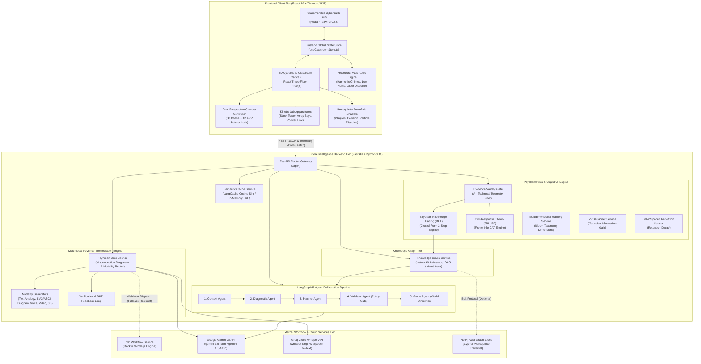
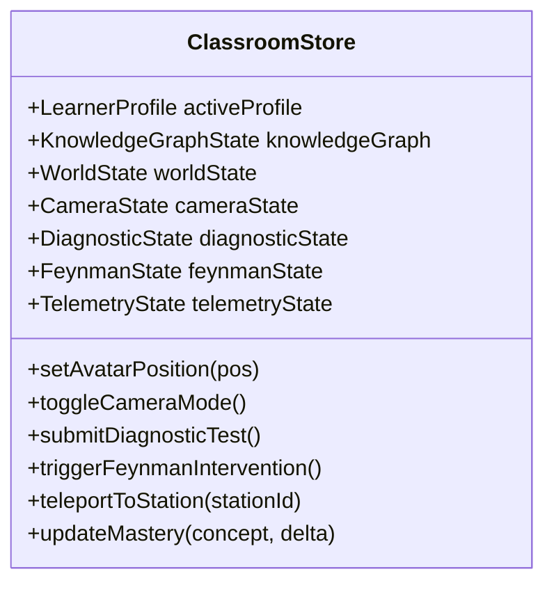
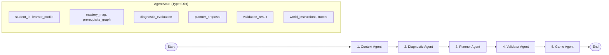
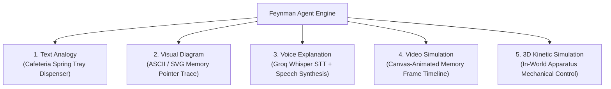
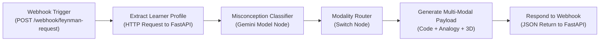
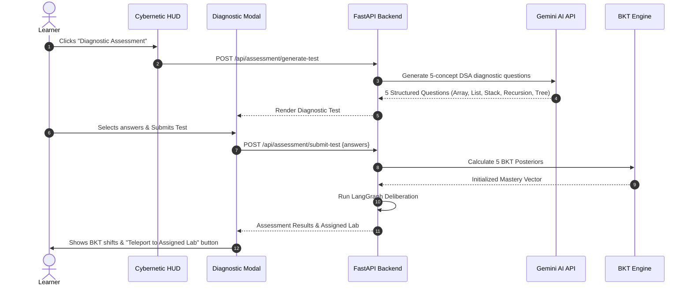
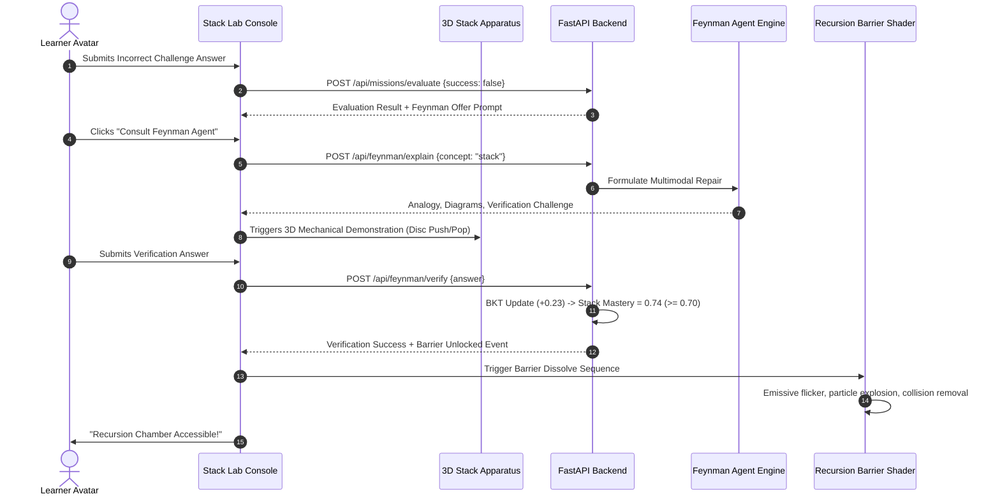
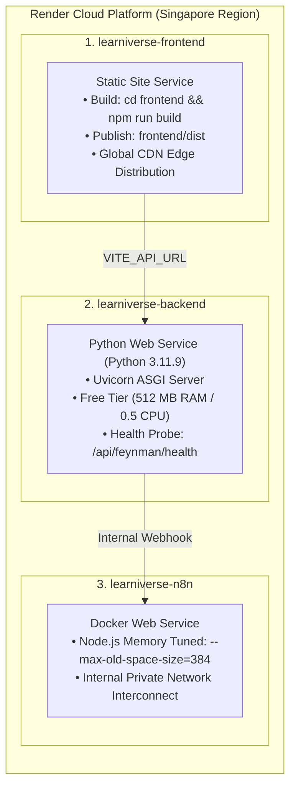

# LearniVerse-AI: System Architecture Specification 🎓🌌

> **"Your knowledge shapes your classroom."**  
> An autonomous, agentic 3D cybernetic learning environment where physical architectural barriers, kinetic apparatuses, learning paths, and pedagogical guidance dynamically adapt to each learner's evolving knowledge state.

---

## 📑 Table of Contents
1. [Executive Summary & Architectural Philosophy](#1-executive-summary--architectural-philosophy)
2. [High-Level System Topology (C4 Container Diagram)](#2-high-level-system-topology-c4-container-diagram)
3. [Frontend Architecture (React 19 + Three.js / R3F)](#3-frontend-architecture-react-19--threejs--r3f)
   - 3.1 Procedural 3D Virtual Classroom Campus
   - 3.2 Dual-Perspective Camera Controller System
   - 3.3 Kinetic In-World Data Structure Apparatuses
   - 3.4 Dynamic Prerequisite Barriers & Shader Dissolve Pipeline
   - 3.5 Global Client State Machine (Zustand)
   - 3.6 Cybernetic Glassmorphic HUD & Modal System
   - 3.7 Spatial Web Audio Synthesis
4. [Core Intelligence Backend Architecture (FastAPI + Python 3.11)](#4-core-intelligence-backend-architecture-fastapi--python-311)
   - 4.1 Modular Endpoint Architecture & Router Layer
   - 4.2 Mathematical Psychometrics & Cognitive Modeling Engine
     - Evidence Validity Gate
     - 2-Step Bayesian Knowledge Tracing (BKT) Engine
     - 2-Parameter Logistic Item Response Theory (2PL-IRT) Engine
     - Multidimensional Mastery Breakdown (Bloom's Taxonomy)
     - Zone of Proximal Development (ZPD) Gaussian Planning
     - SM-2 Spaced Repetition Decay & Scheduling
   - 4.3 Prerequisite Knowledge Graph Engine (DAG)
5. [LangGraph 5-Agent Deliberation Pipeline](#5-langgraph-5-agent-deliberation-pipeline)
   - 5.1 Agent Deliberation State Machine
   - 5.2 Agent Profiles & Responsibilities
   - 5.3 Deterministic Policy Verification & Guardrails
   - 5.4 Telemetry Tracing & Explainability Engine
6. [Multimodal Feynman Explanation & Remediation Engine](#6-multimodal-feynman-explanation--remediation-engine)
   - 6.1 Cognitive Misconception Detection
   - 6.2 The Five Explanation Modalities
   - 6.3 Verification Loop & BKT Posterior Feedback
   - 6.4 Resilient Dual-Tier Routing (Internal Engine vs External n8n)
7. [Semantic Caching Layer (LangCache)](#7-semantic-caching-layer-langcache)
8. [External Workflow Orchestration Tier (n8n Docker Service)](#8-external-workflow-orchestration-tier-n8n-docker-service)
9. [Comprehensive Data Flow & Sequence Diagrams](#9-comprehensive-data-flow--sequence-diagrams)
   - 9.1 End-to-End Adaptive Learning Loop
   - 9.2 Diagnostic Assessment & Knowledge Graph Initialization
   - 9.3 In-Lab Challenge, Feynman Intervention & Barrier Dissolve
10. [Data Models & Schema Specifications](#10-data-models--schema-specifications)
11. [Production Deployment & Infrastructure Architecture (Render)](#11-production-deployment--infrastructure-architecture-render)
12. [Quality Assurance, Automated Testing & Verification](#12-quality-assurance-automated-testing--verification)

---

## 1. Executive Summary & Architectural Philosophy

Traditional digital education tools force learners through rigid, static curricula. When learners struggle with advanced concepts (such as *Recursion* or *Binary Search Trees*), standard platforms treat failure as a local deficiency and repeat the same exercise. In reality, the true root cause is almost always an unmastered prerequisite concept (such as *Stacks* or *Pointers*). Furthermore, abstract computing concepts are conventionally presented through passive 2D text, syntax snippets, or detached conversational chatbots that have no spatial or physical presence.

**LearniVerse-AI** resolves this through an **Agentic 3D Cybernetic Virtual Classroom** where the learning environment itself is the physical execution layer of an adaptive learning policy:

```text
       ┌────────────────────────────────────────────────────────┐
       │                Learner Cognitive State                 │
       │      (Bayesian Mastery Vector + Latent Ability θ)      │
       └───────────────────────────┬────────────────────────────┘
                                   │
                                   ▼
       ┌────────────────────────────────────────────────────────┐
       │              Prerequisite Knowledge Graph              │
       │        (Arrays → Linked Lists → Stacks → ...)          │
       └───────────────────────────┬────────────────────────────┘
                                   │
                                   ▼
       ┌────────────────────────────────────────────────────────┐
       │          LangGraph 5-Agent Deliberation Loop           │
       │  (Context → Diagnostic → Planner → Validator → Game)   │
       └───────────────────────────┬────────────────────────────┘
                                   │
                                   ▼
       ┌────────────────────────────────────────────────────────┐
       │             3D Physical World Morphing                 │
       │  (Floor Conduits, Forcefield Gates, Kinetic Machines)  │
       └────────────────────────────────────────────────────────┘
```

### Key Architectural Tenets

1. **Absolute Mathematical Rigor**: Learning state is never guessed or hallucinated by an unconstrained LLM. Closed-form **Bayesian Knowledge Tracing (BKT)** and **Item Response Theory (2PL-IRT)** mathematically compute mastery probabilities and test information.
2. **Authoritative Backend State**: Transient client telemetry (avatar position, camera angle, particle animations) is decoupled from authoritative cognitive state (mastery posteriors, interaction logs, prerequisite graphs).
3. **Deterministic Policy Guardrails**: While LLMs assist in planning and explanation, a dedicated **Validator Agent** enforces hard prerequisite rules (e.g. `Stack Mastery < 0.70` strictly forbids unlocking the Recursion Wing).
4. **Zero-Asset Procedural 3D Virtual World**: All classroom architecture, archways, kinetic apparatuses, and forcefield shaders are procedurally synthesized in React Three Fiber / WebGL. No external 3D asset downloads, avoiding texture loading stalls, missing glTF files, or CORS failures.
5. **Resilient Graceful Degradation**: Every cloud-dependent subsystem (Gemini LLM, Groq Whisper STT, Neo4j Graph DB, n8n Orchestrator, LangCache) contains an automatic offline/local in-memory fallback.

---

## 2. High-Level System Topology (C4 Container Diagram)

The system is partitioned into three primary tiers: **Frontend Client Tier**, **Core Intelligence Backend Tier**, and **External Workflow / Orchestration Tier**.



---

## 3. Frontend Architecture (React 19 + Three.js / R3F)

The frontend is constructed using **React 19**, **Vite**, **Three.js**, and **@react-three/fiber (R3F)**. It renders an architectural 3D cybernetic campus at 60 FPS while managing UI overlays with glassmorphism styling.

### 3.1 Procedural 3D Virtual Classroom Campus

The 3D environment is laid out in a **Hexagonal Hub-and-Spoke Atrium Topology** with radial subject corridors:

```text
                                  [Recursion Lab]
                                     Azimuth 270°
                                     (-24, 0, 0)
                                     [SEALED GATE]
                                          ▲
                                          │
                                          │
    [Tree & BST Lab]                      │                      [Array Station]
       Azimuth 210°                       │                        Azimuth 30°
      (-12, 0, 20)                        │                       (12, 0, -20)
            ▲                             │                             ▲
             \                            │                            /
              \               ┌───────────┴───────────┐               /
               \              │     CENTRAL DAIS      │              /
                ─────────────►│  • Holographic KG     │◄─────────────
                              │  • AI Mentor Beacon   │
                ─────────────►│  • Origin (0, 0, 0)   │◄─────────────
               /              └───────────┬───────────┘               \
              /                           │                            \
             /                            │                             \
            ▼                             ▼                              ▼
    [Stack Lab Wing]             [Central Archways]             [Linked List Lab]
      Azimuth 150°                    Corridors                    Azimuth 90°
      (12, 0, 20)                                                  (24, 0, 0)
```

#### In-World Spatial Coordinates Table
| Architectural Entity | Spatial Coordinates $(x, y, z)$ | Azimuth Angle | Default State / Prerequisite |
|---|---|---|---|
| **Central Dais & Origin** | `(0, 0.5, 0)` | 0° | Always Open (Spawning Point, Hologram KG, AI Mentor) |
| **AI Mentor Beacon** | `(2, 0.5, 2)` | — | Interactive NPC (`[E]` to consult) |
| **Array Station** | `(12, 0, -20)` | 30° | Open (Foundational Concept) |
| **Linked List Lab** | `(24, 0, 0)` | 90° | Open (Requires Array $\ge 0.50$) |
| **Stack Lab Wing** | `(12, 0, 20)` | 150° | Open (Remediation Hub) |
| **Recursion Chamber** | `(-24, 0, 0)` | 270° | **Prerequisite Barrier Sealed** (Requires Stack $\ge 0.70$) |
| **Tree & BST Canopy** | `(-12, 0, 20)` | 210° | **Prerequisite Barrier Sealed** (Requires Recursion $\ge 0.70$) |

### 3.2 Dual-Perspective Camera Controller System

The camera controller ([`ClassroomCanvas.tsx`](file:///c:/Users/Naren/Desktop/DevHack%20V1/frontend/src/components/canvas/ClassroomCanvas.tsx)) supports seamless switching between two exploration perspectives and a cinematic station inspection mode:

1. **Third-Person Perspective (3P Chase Mode)**:
   - Tracks avatar position with spherical follow coordinates ($r = 6.0$, $\phi = 25^\circ$).
   - Features **Smart Auto-Chase Rotation**: When the avatar navigates forward or turns, the camera's azimuth smoothly lerps behind the avatar's movement heading ($\alpha = 0.08$).
   - Backpedal Awareness: Pressing `[S]` translates the avatar backward while maintaining the forward-facing camera gaze.
   - Mouse Orbit: Click-drag freely orbits azimuth and elevation while automatically respecting minimum and maximum pitch angles ($10^\circ$ to $80^\circ$).
2. **First-Person Perspective (1P FPP Mode)**:
   - Toggled via `[V]` or HUD button. Camera snaps to eye level ($y = 1.6$).
   - Incorporates the HTML5 **Pointer Lock API**: Clicking the canvas captures the hardware cursor, enabling raw mouselook with clamped vertical pitch ($\pm 85^\circ$).
   - Avatar mesh opacity transitions to $0.0$ to prevent self-clipping.
3. **Cinematic Console Framing Mode**:
   - When the learner engages a lab apparatus console (`[E]`), the camera smoothly transitions from free exploration to a fixed, elevated framing angle focusing on the physical 3D apparatus while opening the console UI.

### 3.3 Kinetic In-World Data Structure Apparatuses

Abstract computing structures are embodied as real-time physical mechanisms:

- **Stack Apparatus ([`StackApparatus.tsx`](file:///c:/Users/Naren/Desktop/DevHack%20V1/frontend/src/components/canvas/StackApparatus.tsx))**: A transparent magnetic cylinder with glowing colored memory discs. Executing a `PUSH` physically drops a disc into the cylinder with spring physics; executing a `POP` mechanically raises and expels the top disc, reinforcing **LIFO (Last-In, First-Out)** mechanics.
- **Array Station ([`ArrayStation.tsx`](file:///c:/Users/Naren/Desktop/DevHack%20V1/frontend/src/components/canvas/ArrayStation.tsx))**: Contiguous physical memory bays with glowing index markers `[0]..[N-1]`. An inspection laser moves across bays demonstrating $O(1)$ constant-time random access versus $O(N)$ linear scans.
- **Linked List Lab ([`LinkedListLab.tsx`](file:///c:/Users/Naren/Desktop/DevHack%20V1/frontend/src/components/canvas/LinkedListLab.tsx))**: Floating memory node capsules containing `DATA` and `NEXT` pointer tubes. Radiant energy vectors visually connect nodes and physically redirect during insertion and deletion operations.
- **Recursion Elevator ([`RecursionLabWing.tsx`](file:///c:/Users/Naren/Desktop/DevHack%20V1/frontend/src/components/canvas/RecursionLabWing.tsx))**: A vertical hydraulic elevator shaft where each recursive invocation physically stacks a new translucent glass frame on top of prior frames, unwinding back down upon encountering base-case returns.
- **Tree Canopy ([`TreeLabWing.tsx`](file:///c:/Users/Naren/Desktop/DevHack%20V1/frontend/src/components/canvas/TreeLabWing.tsx))**: A 3D branched binary search tree with illuminated nodes that light up sequentially during In-Order, Pre-Order, and Post-Order recursive traversals.

### 3.4 Dynamic Prerequisite Barriers & Shader Dissolve Pipeline

Access to advanced laboratory wings is governed by in-world **Prerequisite Barriers** ([`PrerequisiteBarrier.tsx`](file:///c:/Users/Naren/Desktop/DevHack%20V1/frontend/src/components/canvas/PrerequisiteBarrier.tsx)):

- **Visual Forcefield Shader**: An energized vertical plane with dynamic pulse lines and emissive crimson glow (`#ff0055`).
- **Physical Collision Wall**: A mathematical plane boundary that restricts avatar translation when active.
- **Floating Diagnostic Plaque**: Projected holographically at eye level, displaying the prerequisite status (e.g. `Prerequisite Gap: STACK mastery 0.38 < 0.70`).
- **Barrier Dissolve Animation**: When the learner's mastery crosses the $0.70$ threshold, the barrier triggers an event: the forcefield flickers, plays an audio resonance chime, dissolves into cyan particle embers (`#00f0ff`), and removes collision barriers.

### 3.5 Global Client State Machine (Zustand)

Client state is managed by a centralized Zustand store ([`useClassroomStore.ts`](file:///c:/Users/Naren/Desktop/DevHack%20V1/frontend/src/store/useClassroomStore.ts)):



### 3.6 Cybernetic Glassmorphic HUD & Modal System

The UI layer is rendered on top of the 3D canvas using Tailwind CSS with glassmorphism (`backdrop-blur-md`, `bg-slate-900/80`, `border-cyan-500/30`):

- **HUD ([`HUD.tsx`](file:///c:/Users/Naren/Desktop/DevHack%20V1/frontend/src/components/ui/HUD.tsx))**: Displays active mission objective, mastery gauges, learner profile switcher (`learner_a`, `learner_b`, `learner_c`), camera mode toggle (`1P`/`3P`), audio mute toggle, and action buttons.
- **Diagnostic Assessment Modal ([`DiagnosticModal.tsx`](file:///c:/Users/Naren/Desktop/DevHack%20V1/frontend/src/components/ui/DiagnosticModal.tsx))**: Multi-step adaptive testing modal showing dynamic code snippets, progress bars, and post-test BKT shift visualizers.
- **Multimodal Feynman Modal ([`FeynmanModal.tsx`](file:///c:/Users/Naren/Desktop/DevHack%20V1/frontend/src/components/ui/FeynmanModal.tsx))**: Comprehensive remediation interface supporting 5 tabs (Analogy, Visual Diagram, Voice STT with Groq Whisper, Video Simulation, 3D Apparatus Control) and an interactive verification challenge.
- **Multi-Agent Telemetry Drawer ([`TelemetryDrawer.tsx`](file:///c:/Users/Naren/Desktop/DevHack%20V1/frontend/src/components/ui/TelemetryDrawer.tsx))**: Toggled with `[T]`, renders real-time deliberation logs for each agent in the LangGraph pipeline, displaying explainability rationales and policy checks.
- **Station Console Modals ([`StationConsoleModal.tsx`](file:///c:/Users/Naren/Desktop/DevHack%20V1/frontend/src/components/ui/StationConsoleModal.tsx))**: Interactive IDE terminals at each station for executing challenges and viewing apparatus feedback.

### 3.7 Spatial Web Audio Synthesis

A Web Audio API synthesizer generates audio cues without external audio asset downloads:
- **Footsteps**: Modulated white noise bursts with low-pass filtering.
- **Success Chime**: Dual sine wave arpeggio (harmonic major third).
- **Error Hum**: Low-frequency sawtooth wave ($110\text{ Hz}$) with subtle decay.
- **Barrier Dissolve**: Resonant band-pass filtered noise sweep with exponential decay.

---

## 4. Core Intelligence Backend Architecture (FastAPI + Python 3.11)

The backend is built with **FastAPI**, **Pydantic**, and **Python 3.11**, providing high-throughput asynchronous execution, strict type validation, and automated OpenAPI documentation.

### 4.1 Modular Endpoint Architecture & Router Layer

The backend modularizes endpoints into 10 routers ([`backend/app/routers/`](file:///c:/Users/Naren/Desktop/DevHack%20V1/backend/app/routers)):

```text
backend/app/routers/
├── learner.py       # Profile retrieval, switching, and student mastery maps
├── world.py         # 3D classroom state (barriers, conduits, lighting)
├── mentor.py        # AI Mentor contextual dialogue queries
├── missions.py      # Active missions, station challenges, and submissions
├── interactions.py  # Ingestion of atomic learning interactions
├── agents.py        # 5-Agent LangGraph deliberation triggering
├── feynman.py       # Multimodal Feynman explanations, STT, and verification
├── curriculum.py    # Concept nodes, prerequisite graph traversal
├── assessment.py    # AI diagnostic test generation and evaluation
└── cache.py         # Semantic cache inspection and management
```

### 4.2 Mathematical Psychometrics & Cognitive Modeling Engine

#### 1. Evidence Validity Gate ([`evidence_gate_service.py`](file:///c:/Users/Naren/Desktop/DevHack%20V1/backend/app/services/evidence_gate_service.py))
To prevent technical network latency, disconnects, or client buffering from corrupting student mastery estimates, the system passes every event through an **Evidence Validity Gate**:

$$V_i = \mathbb{I}(\text{latency} \le 1500\text{ms}) \cdot \mathbb{I}(\text{time} \ge t_{\min}) \cdot \mathbb{I}(\text{error} = \emptyset) \in \{0.0, 1.0\}$$

If $V_i = 0$, technical telemetry alters delivery mode or UI alerts, but the effective BKT update is clamped to zero:

$$\Delta M_{\text{effective}} = V_i \cdot \Delta M$$

#### 2. Bayesian Knowledge Tracing (BKT) Engine ([`bkt_service.py`](file:///c:/Users/Naren/Desktop/DevHack%20V1/backend/app/services/bkt_service.py))
The backend maintains a continuous latent mastery probability $P(L_t) \in [0.0, 1.0]$ for each concept. When a learner attempts a challenge, BKT updates mastery in two steps:

**Step 1: Posterior Observation Update**
- If the response is **correct** ($Y_t = 1$):
  $$P(L_t \mid Y_t = 1) = \frac{P(L_{t-1}) \cdot (1 - P(S))}{P(L_{t-1}) \cdot (1 - P(S)) + (1 - P(L_{t-1})) \cdot P(G)}$$
- If the response is **incorrect** ($Y_t = 0$):
  $$P(L_t \mid Y_t = 0) = \frac{P(L_{t-1}) \cdot P(S)}{P(L_{t-1}) \cdot P(S) + (1 - P(L_{t-1})) \cdot (1 - P(G))}$$

Where:
- $P(L_{t-1})$: Prior probability of concept mastery.
- $P(G)$: Guess probability (student solves correctly despite not knowing the concept).
- $P(S)$: Slip probability (student slips and fails despite knowing the concept).

**Step 2: Learning Transition Update**
$$P(L_t) = P(L_t \mid Y_t) + (1 - P(L_t \mid Y_t)) \cdot P(T)$$
Where $P(T)$ is the transition probability of acquiring mastery during the learning interaction.

##### Concept Parameter Calibration Table
| Concept | $P(T)$ (Transit) | $P(G)$ (Guess) | $P(S)$ (Slip) | Mastery Threshold |
|---|---|---|---|---|
| **Arrays & Memory** | 0.10 | 0.25 | 0.08 | 0.70 |
| **Linked Lists** | 0.12 | 0.22 | 0.10 | 0.70 |
| **Stacks (LIFO)** | 0.05 | 0.54 | 0.11 | 0.70 |
| **Recursion** | 0.08 | 0.20 | 0.12 | 0.70 |
| **Binary Search Trees** | 0.08 | 0.18 | 0.12 | 0.70 |

#### 3. Item Response Theory (2PL-IRT) Engine ([`irt_service.py`](file:///c:/Users/Naren/Desktop/DevHack%20V1/backend/app/services/irt_service.py))
For Computerized Adaptive Testing (CAT), the system models question responses using the **2-Parameter Logistic (2PL) Model**:

$$P_i(\theta) = \frac{1}{1 + e^{-1.7 \cdot a_i (\theta - b_i)}}$$

Where:
- $\theta \in [-3.0, +3.0]$: Latent learner ability.
- $b_i$: Question difficulty parameter.
- $a_i$: Question discrimination parameter.

The engine selects the next optimal question by maximizing **Fisher Information**:

$$I_i(\theta) = a_i^2 \cdot P_i(\theta) \cdot (1 - P_i(\theta))$$

This guarantees diagnostic convergence in only 4–6 questions, minimizing assessment fatigue.

#### 4. Multidimensional Mastery Breakdown ([`multidimensional_mastery_service.py`](file:///c:/Users/Naren/Desktop/DevHack%20V1/backend/app/services/multidimensional_mastery_service.py))
Mastery is tracked across four cognitive dimensions aligned with Bloom's Taxonomy:
1. **Recall**: Syntactic and operational memory retrieval.
2. **Understanding**: Conceptual grasp of underlying data structures.
3. **Problem Solving**: Algorithmic implementation and execution.
4. **Transfer**: Applying the concept to novel, unfamiliar contexts.

#### 5. Zone of Proximal Development (ZPD) Planning ([`zpd_planner_service.py`](file:///c:/Users/Naren/Desktop/DevHack%20V1/backend/app/services/zpd_planner_service.py))
To avoid boreout (tasks too easy) or burnout (tasks too difficult), candidate topics are ranked by expected learning gain using a Gaussian curve centered at the edge of learner mastery ($\mu_{\text{zpd}} = 0.50$, $\sigma = 0.20$):

$$\text{Gain}(c) = \exp\left(-\frac{(M_c - \mu_{\text{zpd}})^2}{2\sigma^2}\right)$$

#### 6. SM-2 Spaced Repetition Scheduling ([`sm2_service.py`](file:///c:/Users/Naren/Desktop/DevHack%20V1/backend/app/services/sm2_service.py))
Mastery decays over elapsed time unless refreshed, calculated using modified SuperMemo-2 algorithms:

$$I_n = \begin{cases} 1 & n = 1 \\ 6 & n = 2 \\ I_{n-1} \cdot EF & n > 2 \end{cases}$$

### 4.3 Prerequisite Knowledge Graph Engine (DAG)

The curriculum is formalized as a strict Directed Acyclic Graph (DAG) implemented via **NetworkX** with persistent **Neo4j** graph database connectivity ([`knowledge_graph_service.py`](file:///c:/Users/Naren/Desktop/DevHack%20V1/backend/app/services/knowledge_graph_service.py)):

```mermaid
graph LR
    classDef mastered fill:#10b981,stroke:#059669,stroke-width:2px,color:#fff;
    classDef active fill:#0ea5e9,stroke:#0284c7,stroke-width:2px,color:#fff;
    classDef locked fill:#ef4444,stroke:#b91c1c,stroke-width:2px,color:#fff;

    Arrays["📦 Arrays & Memory<br/>(Mastery: 0.92)"]:::mastered
    LinkedList["🔗 Linked Lists<br/>(Mastery: 0.78)"]:::mastered
    Stacks["🟧 Stacks (LIFO)<br/>(Mastery: 0.38)"]:::active
    Recursion["🌀 Recursion Chamber<br/>(LOCKED - Prereq: Stack ≥ 0.70)"]:::locked
    Trees["🌲 Trees & BST<br/>(LOCKED - Prereq: Recursion ≥ 0.70)"]:::locked

    Arrays -->|"prerequisite_of"| LinkedList
    LinkedList -->|"prerequisite_of"| Stacks
    Stacks -->|"prerequisite_barrier"| Recursion
    Recursion -->|"prerequisite_barrier"| Trees
```



#### Barrier Gate Logic:
- A wing entrance is **SEALED** if $\exists p \in \text{Prerequisites}(W)$ such that $M_p < 0.70$.
- A wing entrance is **ACCESSIBLE** if $\forall p \in \text{Prerequisites}(W)$, $M_p \ge 0.70$.

---

## 5. LangGraph 5-Agent Deliberation Pipeline

Adaptive planning is handled by a sequential 5-agent deliberation graph constructed using **LangGraph** ([`backend/app/agents/`](file:///c:/Users/Naren/Desktop/DevHack%20V1/backend/app/agents)):



### 5.1 Agent Deliberation State Machine
The workflow uses a shared TypedDict state (`AgentState`) containing:
- `student_id`: Active learner identifier.
- `mastery_map`: Normalized BKT mastery probabilities.
- `prerequisite_graph`: In-memory topological dependency graph.
- `diagnostic_evaluation`: Identified prerequisite gaps and readiness vectors.
- `planner_proposal`: Candidate action (`REMEDIATE`, `LEARN`, `PRACTICE`, `CHALLENGE`) and target concept.
- `validation_result`: Boolean policy certification and safety audit report.
- `world_instructions`: Directives for 3D barriers, emissive conduits, and station missions.
- `traces`: Step-by-step logs published to the client Telemetry Drawer.

### 5.2 Agent Profiles & Responsibilities

| Agent Node | Responsibility | Primary Input | Output to State |
|---|---|---|---|
| **1. Context Agent** | Aggregates learner history, current wing location, and active BKT mastery scores. | `student_id`, database | `learner_profile`, `mastery_map`, `prerequisite_graph` |
| **2. Diagnostic Agent** | Traverses curriculum graph to detect weak prerequisite nodes ($M < 0.70$) and cognitive roadblocks. | `mastery_map`, `prerequisite_graph` | `diagnostic_evaluation` (gaps, readiness) |
| **3. Planner Agent** | Recommends optimal pedagogical action (`REMEDIATE`, `LEARN`, `PRACTICE`, `CHALLENGE`) and target concept. | `diagnostic_evaluation` | `planner_proposal` (target concept, action, rationale) |
| **4. Validator Agent** | **Deterministic Safety Gate**: Enforces educational policy. Rejects unsafe plans that violate prerequisite constraints. | `planner_proposal`, `prerequisite_graph` | `validation_result` (approved / rejected + correction) |
| **5. Game Agent** | Translates pedagogical decision into concrete 3D virtual classroom directives. | `validation_result` | `world_instructions` (conduits, barrier states, mission) |

### 5.3 Deterministic Policy Verification & Guardrails

The **Validator Agent** acts as an incorruptible policy gatekeeper:
1. **Prerequisite Invariant**: If a student is assigned to wing $W$, all ancestors $\text{Anc}(W)$ must satisfy $M \ge 0.70$.
2. **Policy Violation Interception**: If the Planner Agent attempts to prescribe `LEARN: Recursion` while `Stack Mastery = 0.38`, the Validator Agent intercepts the plan, logs a policy rejection in telemetry, and forces a fallback to `REMEDIATE: Stack`.

### 5.4 Telemetry Tracing & Explainability Engine

Every deliberation emits an explainable trace packet accessible in the client Telemetry Drawer:
```json
{
  "deliberation_id": "delib_a891f2",
  "student_id": "learner_b",
  "decision": "REMEDIATE",
  "target_concept": "stack",
  "rationale": "Learner attempted to access Recursion Lab, but Stack mastery is 0.38 (threshold 0.70). Immediate remediation at Stack Lab apparatus required.",
  "policy_enforced": "PREREQUISITE_GATE_RESTRICTION",
  "barrier_updates": { "recursion": "SEALED", "tree": "SEALED" },
  "guiding_conduit": "conduit_to_stack_lab"
}
```

---

## 6. Multimodal Feynman Explanation & Remediation Engine

When learners encounter cognitive obstacles, the **Feynman Agent** ([`feynman_service.py`](file:///c:/Users/Naren/Desktop/DevHack%20V1/backend/app/services/feynman_service.py)) provides targeted pedagogical repairs based on the Feynman Technique: *simplify, detect gaps, explain with analogies, and verify*.

### 6.1 Cognitive Misconception Detection

The agent identifies specific conceptual traps:
- **Stacks**: Confusing LIFO (Last-In, First-Out) with FIFO (First-In, First-Out).
- **Recursion**: Forgetting base-case return conditions, causing infinite call-stack accumulation.
- **Linked Lists**: Losing reference pointers by overwriting `node.next` before caching the subsequent node.
- **Arrays**: Attempting dynamic resizing on fixed memory blocks.

### 6.2 The Five Explanation Modalities



1. **Text Analogy**: Plain-English analogies (e.g. spring-loaded cafeteria plate dispenser for Stacks; Russian nesting dolls for Recursion).
2. **Visual Diagram**: Interactive SVG/ASCII architectural state diagrams illustrating pointer manipulation and memory allocations step-by-step.
3. **Voice Explanation**: Learners speak questions via microphone, transcribed in real time via **Groq Whisper (`whisper-large-v3`)**, with spoken audio responses.
4. **Video Simulation**: Multi-frame canvas animations showing call-stack pushes and unwinding over simulated clock cycles.
5. **3D Kinetic Simulation**: Sends direct manipulation directives to the 3D apparatus in the learner's lab (e.g. physically pushing and popping stack memory discs).

### 6.3 Verification Loop & BKT Posterior Feedback

The Feynman session does not end with an explanation; it concludes with a **Verification Challenge**:
- The student solves a targeted transfer problem.
- Submitting the correct verification triggers `/api/feynman/verify`.
- The engine injects a positive evidence observation into the BKT service, boosting mastery (e.g. Stack mastery: $0.38 \rightarrow 0.61 \rightarrow 0.74$).
- If mastery exceeds $0.70$, the **Barrier Dissolve** sequence executes immediately.

### 6.4 Resilient Dual-Tier Routing (Internal Engine vs External n8n)

```text
┌─────────────────────────────────────────────────────────────┐
│                 Feynman Request Dispatcher                  │
└──────────────┬───────────────────────────────┬──────────────┘
               │ (Primary / If Configured)     │ (Default / Zero-Config Fallback)
               ▼                               ▼
     ┌───────────────────┐           ┌───────────────────┐
     │   n8n Webhook     │           │  Built-in Python  │
     │   Orchestrator    │           │   Feynman Engine  │
     │  (Docker Service) │           │ (Gemini + Local)  │
     └─────────┬─────────┘           └─────────┬─────────┘
               │ (If Timeout / Offline)        │
               └──────────────────────────────►│
                                               ▼
                                     Guaranteed Explanation
```

If `N8N_WEBHOOK_URL` is configured and online, requests flow through n8n. If unreachable or unconfigured, the internal Python service handles the request seamlessly with sub-100ms response time.

---

## 7. Semantic Caching Layer (LangCache)

To minimize LLM API token consumption and achieve sub-50ms explanation retrieval, the backend integrates a **Semantic Cache Service** ([`langcache_service.py`](file:///c:/Users/Naren/Desktop/DevHack%20V1/backend/app/services/langcache_service.py)):

- **Embedding Similarity Matching**: Evaluates user queries using cosine similarity against stored vectors.
- **Threshold**: Matches with similarity $> 0.92$ return cached pedagogical explanations instantly.
- **Cache Eviction**: Automatic TTL decay and LRU eviction.
- **Fallback**: Operates using an in-memory cosine vector index when external cache services are unavailable.

---

## 8. External Workflow Orchestration Tier (n8n Docker Service)

The optional **n8n Orchestration Service** ([`n8n/`](file:///c:/Users/Naren/Desktop/DevHack%20V1/n8n)) provides visual workflow management for multi-step AI tasks:



- **Container Configuration**: Runs on Render Free Tier via [`n8n/Dockerfile`](file:///c:/Users/Naren/Desktop/DevHack%20V1/n8n/Dockerfile) with Node.js memory limits (`--max-old-space-size=384`) to operate safely within a 512 MB memory footprint.
- **Pre-Packaged Workflows**: Includes [`feynman_workflow.json`](file:///c:/Users/Naren/Desktop/DevHack%20V1/n8n/feynman_workflow.json) for 1-click import.

---

## 9. Comprehensive Data Flow & Sequence Diagrams

### 9.1 End-to-End Adaptive Learning Loop

```mermaid
sequenceDiagram
    autonumber
    actor Learner as Learner Avatar
    participant Canvas as 3D Virtual Classroom
    participant API as FastAPI Backend
    participant BKT as BKT & Psychometrics Engine
    participant KG as Knowledge Graph (DAG)
    participant Agents as LangGraph Deliberation
    participant Feynman as Feynman Agent

    Learner->>Canvas: Navigates & Attempts Challenge
    Canvas->>API: POST /api/interactions/log {student_id, concept, success}
    API->>BKT: Update Posterior Mastery P(L_t)
    BKT->>KG: Update Node Mastery in DAG
    KG-->>API: Prerequisite Barrier Statuses
    API->>Agents: POST /api/agents/deliberate
    
    rect rgb(15, 23, 42)
        Note over Agents: Context Agent: Gathers active masteries & wing
        Note over Agents: Diagnostic Agent: Flags prerequisite gaps (Stack < 0.70)
        Note over Agents: Planner Agent: Selects REMEDIATE at Stack Lab
        Note over Agents: Validator Agent: Enforces barrier lock on Recursion
        Note over Agents: Game Agent: Sets conduits to Stack Lab
    end

    Agents-->>API: Deliberation Decision & World Directives
    API-->>Canvas: World State Update (Conduits, Locked Gates, HUD Mission)
    Canvas->>Learner: Emissive floor conduits pulse toward Stack Lab
```



### 9.2 Diagnostic Assessment & Knowledge Graph Initialization



### 9.3 In-Lab Challenge, Feynman Intervention & Barrier Dissolve



---

## 10. Data Models & Schema Specifications

The backend exposes fully typed Pydantic models ([`backend/app/models/`](file:///c:/Users/Naren/Desktop/DevHack%20V1/backend/app/models)):

### 10.1 Learner Profile & Mastery Schema
```python
class ConceptMastery(BaseModel):
    concept: str
    mastery: float          # P(L_t) Bayesian posterior [0.0 - 1.0]
    ability_theta: float    # IRT latent ability [-3.0 to +3.0]
    confidence: float
    status: Literal["unexplored", "weak", "progressing", "mastered"]
    recall_score: float
    understanding_score: float
    problem_solving_score: float
    transfer_score: float
    last_practiced_at: Optional[datetime]

class LearnerProfile(BaseModel):
    student_id: str
    name: str
    learning_style: Literal["visual", "tactile", "auditory", "analytical"]
    active_wing: str
    masteries: Dict[str, ConceptMastery]
    overall_progress: float
```

### 10.2 LangGraph Deliberation Response Schema
```python
class AgentDecisionResponse(BaseModel):
    deliberation_id: str
    student_id: str
    decision: Literal["REMEDIATE", "LEARN", "PRACTICE", "CHALLENGE", "REVIEW"]
    target_concept: str
    assigned_station: str
    rationale: str
    validation_status: Literal["APPROVED", "REJECTED_AND_CORRECTED"]
    policy_rule_enforced: Optional[str]
    barriers: Dict[str, BarrierState]
    active_conduits: List[str]
    agent_traces: List[AgentTraceItem]
```

### 10.3 Multimodal Feynman Explanation Schema
```python
class FeynmanExplanationResponse(BaseModel):
    session_id: str
    concept: str
    detected_misconception: str
    pedagogical_strategy: str
    selected_modality: Literal["text", "visual", "voice", "video", "3d"]
    text_analogy: str
    visual_diagram_svg: Optional[str]
    voice_audio_url: Optional[str]
    video_simulation_frames: Optional[List[VideoFrame]]
    three_d_instructions: Optional[ThreeDApparatusInstruction]
    verification_question: VerificationQuestion
```

---

## 11. Production Deployment & Infrastructure Architecture (Render)

LearniVerse-AI is engineered for production deployment on **Render** via [`render.yaml`](file:///c:/Users/Naren/Desktop/DevHack%20V1/render.yaml) Infrastructure-as-Code:



### Deployment Configuration Matrix
| Service Identifier | Service Type | Runtime | Port | Health Check Endpoint | Memory Optimization |
|---|---|---|---|---|---|
| `learniverse-frontend` | Static Site | Vite / React 19 | 80/443 | Static Index | Tree-shaken bundle (`frontend/dist`) |
| `learniverse-backend` | Web Service | Python 3.11 / FastAPI | 8000 | `/api/feynman/health` | Headless async workers, in-memory caches |
| `learniverse-n8n` | Web Service | Docker (Debian/Node) | 5678 | TCP Socket Probe | `--max-old-space-size=384` |

---

## 12. Quality Assurance, Automated Testing & Verification

The codebase includes an enterprise-grade automated verification suite spanning psychometric mathematics, 3D kinematics, and agent workflows:

```bash
# 1. Frontend Test Suite (245 Vitest unit & integration tests)
cd frontend
npm test

# 2. Frontend Production Build & TypeScript Verification
npm run build

# 3. Backend Pytest Suite (BKT, IRT, LangGraph, Feynman, Webhooks)
python -m pytest backend/tests/ -v
```

### Test Coverage Highlights
- ✅ **BKT Engine Numerical Stability**: Tests closed-form posterior convergence across boundary conditions ($P(L) \to 0$, $P(L) \to 1$) and validates zero-update behavior under $V_i = 0$ validity failure.
- ✅ **2PL-IRT Adaptive Convergence**: Asserts Fisher Information maximization selects items that reduce estimation variance.
- ✅ **Prerequisite Graph Consistency**: Validates cycle-free DAG topology and verifies that prerequisite barriers lock access deterministically.
- ✅ **LangGraph 5-Agent Deliberation**: Validates full state transitions, safety gate interception, and fallback correction.
- ✅ **Feynman Multimodal Pipeline**: Tests Groq Whisper transcription adapter, Gemini synthesis, offline fallbacks, and verification BKT feedback.
- ✅ **Dual-Perspective Camera & Mouselook**: Verifies 3P spherical auto-chase azimuth interpolation, 1P pointer lock transitions, and pitch clamping.

---

## 📜 Architectural Sign-Off
- **System**: LearniVerse-AI Cybernetic Virtual Classroom
- **Document Version**: 1.0.0
- **Status**: Production-Ready / Implemented
- **License**: MIT
